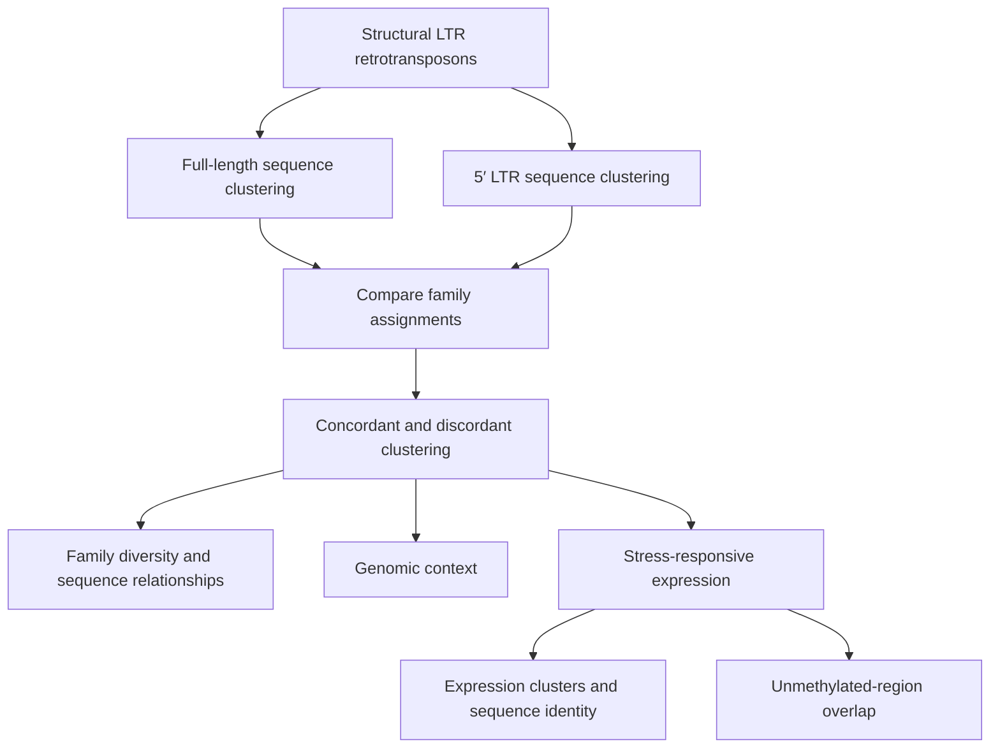

<div align="center">

# Discordant LTRs

### Exploring retrotransposon family diversity through full-length and 5′ LTR sequence clustering

**Maize · Setaria · Transposable elements · Genome organization · Stress-responsive expression**

[](scripts/)
[](#study-systems)
[](#study-systems)
[](#figure-guide)

</div>

---

## Overview

Long terminal repeat (LTR) retrotransposons contribute substantially to plant genome diversity. How we define a transposable element (TE) *family* depends on which portion of the element is compared. Clustering by the **full-length sequence** and clustering by the **5′ LTR** can therefore produce different family assignments.

This repository accompanies an analysis of **clustering concordance and discordance** in maize and *Setaria*. It brings together the R Markdown scripts and supporting processed data used to examine family relationships, genomic context, and TE expression.

> **Central question:** What do differences between full-length and 5′ LTR-based family assignments reveal about LTR retrotransposon diversity and biology?

## Analysis at a glance



*Conceptual overview of the analyses; this diagram is not a literal executable pipeline.*

## Study systems

| System | Role in the analysis |
|---|---|
| **Maize** (*Zea mays*, B73) | LTR family clustering, genomic context, and expression analyses |
| **Setaria** | Comparative LTR family clustering and genomic context analyses |

## Figure guide

The repository includes the six figure-generation notebooks used for the manuscript analysis.

| Figure | Focus | R Markdown script |
|:--:|---|---|
| **1** | Comparing full-length and 5′ LTR family clustering | [`figure1_complete_final.Rmd`](scripts/figure1_complete_final.Rmd) |
| **2** | Family relationships and clustering discordance | [`figure2_complete.Rmd`](scripts/figure2_complete.Rmd) |
| **3** | Genomic context and distance to genes | [`figure3_complete.Rmd`](scripts/figure3_complete.Rmd) |
| **4** | TE expression patterns across stress conditions | [`figure4_complete.Rmd`](scripts/figure4_complete.Rmd) |
| **5** | Expression-cluster occupancy and sequence identity | [`figure5_complete.Rmd`](scripts/figure5_complete.Rmd) |
| **6** | Clustering status, unmethylated regions, and expression | [`figure6_complete.Rmd`](scripts/figure6_complete.Rmd) |

*Figure descriptions are a navigation guide, not a substitute for the manuscript's full figure legends.*

## Repository structure

```text
Discordant_LTRs/
├── scripts/
│   ├── figure1_complete_final.Rmd
│   ├── figure2_complete.Rmd
│   ├── figure3_complete.Rmd
│   ├── figure4_complete.Rmd
│   ├── figure5_complete.Rmd
│   └── figure6_complete.Rmd
├── data/
│   ├── classification/       # Maize and Setaria SiLiX assignments; TE status
│   ├── annotations/          # Gene/TE annotations and genomic intervals
│   ├── expression/
│   │   ├── figure5/          # Saved expression-family summary tables
│   │   ├── vsearch/          # 17 cluster-level pairwise alignment tables
│   │   ├── metadata.csv
│   │   └── raw_counts_*.txt
│   └── regulation/           # Structural LTR overlap with UMRs
└── docs/                     # Input manifest and path audit
```

### Key data directories

- **[`data/classification/`](data/classification/):** SiLiX family assignments for full-length and 5′ LTR sequences, including the clustering inputs used in the maize and *Setaria* analyses.
- **[`data/annotations/`](data/annotations/):** Gene and TE annotations, including compressed `.gff3.gz` and `.gtf.gz` files.
- **[`data/expression/`](data/expression/):** Count matrices, sample metadata, saved summary tables, and the 17 VSEARCH pairwise-alignment files used for Figure 5.
- **[`data/regulation/`](data/regulation/):** TE overlap data for unmethylated-region analyses.
- **[`docs/`](docs/):** File collection manifest and input-reference audit.

## Using this repository

### 1. Clone the repository

```bash
git clone https://github.com/HirschLabUMN/Discordant_LTRs.git
cd Discordant_LTRs
```

### 2. Explore the figure scripts

Each figure has a corresponding `.Rmd` file in [`scripts/`](scripts/). The scripts document the analysis and plotting code.

### 3. Locate the supporting inputs

Processed input files are organized in [`data/`](data/). For a starting inventory, see [`docs/figure_input_manifest.tsv`](docs/figure_input_manifest.tsv).

**Important reproducibility note:** The original R Markdown scripts have been preserved **without modifying their absolute file paths**. They reference locations on the University of Minnesota MSI research filesystem. Consequently, cloning this repository alone does **not** make the notebooks immediately executable on another computer. To run them elsewhere, users must provide the required inputs at the expected locations or adapt the paths in their own local copies.

Some large annotations are distributed as gzip-compressed files (`.gz`) to fit GitHub's file-size limits; the original scripts may expect their uncompressed versions. The input manifest documents collection status, but the complete set of runtime dependencies has not been independently validated by executing all six notebooks from a fresh clone.

## Methods and data notes

The analysis compares family assignments derived from full-length retrotransposon sequences and their 5′ LTR regions. Supporting analyses consider genomic positioning, expression under experimental stress conditions, relationships between expression clusters and sequence identity, and overlap with unmethylated regions (UMRs).

The repository contains **processed inputs and analysis notebooks**, not the original FASTA sequence collections or a fully automated end-to-end pipeline.

## Citation

If you use this repository, please cite the associated manuscript when its bibliographic details are available. A formal citation can be added here after publication.

## Research group

Developed as part of research in the **Hirsch Lab**, University of Minnesota.

---

<div align="center">
  <sub>Understanding LTR retrotransposon diversity through complementary views of sequence, genome context, and expression.</sub>
</div>
